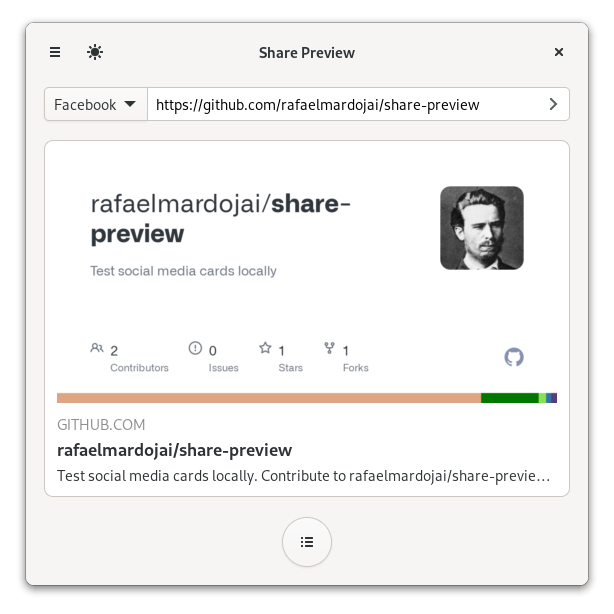

<h1 align="center">
	<br>
	Share Preview
</h1>

[](https://circle.gnome.org/)
[](https://stopthemingmy.app)

[](https://github.com/rafaelmardojai/share-preview/blob/master/COPYING)
[](https://paypal.me/RafaelMardojaiCM)
[](https://liberapay.com/rafaelmardojai/donate)

<p align="center"><strong>Test social media cards locally</strong></p>

<p align="center">
  <a href="https://flathub.org/apps/details/com.rafaelmardojai.SharePreview"></a>
</p>

<p align="center">
  
</p>


## Description
Preview and debug websites metadata tags for social media share.

## Third Party Packages

| Distribution | Package | Maintainer |
|:-:|:-:|:-:|
| Arch Linux (AUR) | [share-preview](https://aur.archlinux.org/packages/share-preview), [share-preview-bin](https://aur.archlinux.org/packages/share-preview-bin) | [Archisman Panigrahi](https://github.com/apandada1/) |


## Build from source

- You can clone and run from GNOME Builder.

### Requirements

TODO

- Alternatively, use the following commands to build it with meson.
```bash
meson builddir --prefix=/usr/local
sudo ninja -C builddir install
```

## Translations
Share Preview is translated into several languages. If your language is missing or incomplete, please help to [translate Share Preview in Weblate](https://hosted.weblate.org/engage/share-preview/).

<a href="https://hosted.weblate.org/engage/share-preview/">

</a>

## Credits
Developed by **[Rafael Mardojai CM](https://github.com/rafaelmardojai)** and [contributors](https://github.com/rafaelmardojai/share-preview/graphs/contributors).

## Donate
If you want to support development, consider donating via [PayPal](https://paypal.me/RafaelMardojaiCM).
